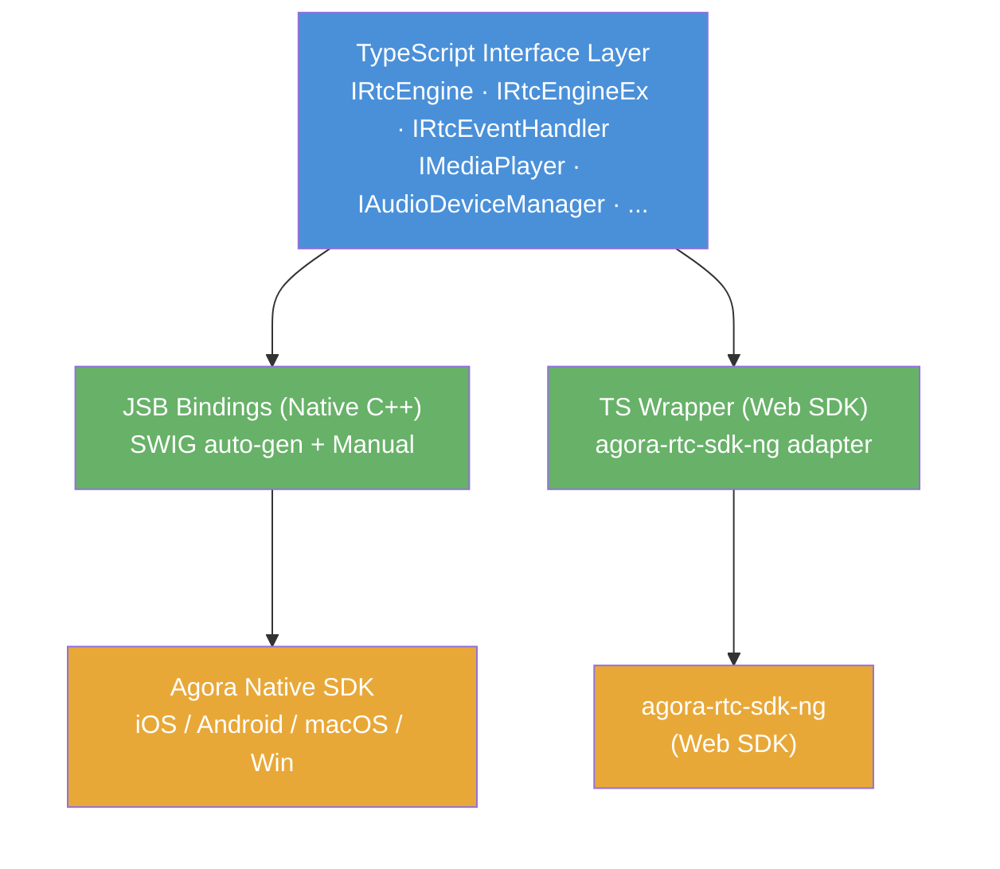

# Agora RTC Extension for Cocos Creator

[中文](README.zh-CN.md)

A Cocos Creator editor extension that integrates the [Agora RTC SDK](https://www.agora.io/) for real-time communication. Build video calling, interactive live streaming, screen sharing, and media playback features into your Cocos Creator games and applications.

## Features

- **Video/Voice Calls** — Real-time 1-on-1 and group video/audio calls
- **Screen Sharing** — Share screen content during calls (native platforms)
- **Media Player** — Play local and remote media files with full playback controls
- **Media Recording** — Record audio/video streams to local files
- **Interactive Live Streaming** — CDN push streams with transcoding support
- **Spatial Audio** — 3D positional audio for immersive experiences
- **Beauty & Video Effects** — Face beautification, filters, virtual background, video denoiser
- **Music Content Center** — Music playback and mixing capabilities
- **Data Channels** — Send custom data messages between users
- **Content Inspection** — AI-powered content moderation
- **Encryption** — End-to-end encryption for secure communication

## Platform Capability Matrix

| Capability | iOS | Android | macOS | Windows | Browser (Chrome) |
|---|:---:|:---:|:---:|:---:|:---:|
| Join/Leave Channel | ✅ | ✅ | ✅ | ✅ | ✅ |
| Video Call | ✅ | ✅ | ✅ | ✅ | ✅ |
| Audio Call | ✅ | ✅ | ✅ | ✅ | ✅ |
| Mute Local Audio/Video | ✅ | ✅ | ✅ | ✅ | ✅ |
| Mute Remote Audio/Video | ✅ | ✅ | ✅ | ✅ | ✅ |
| Client Role (Broadcaster/Audience) | ✅ | ✅ | ✅ | ✅ | ✅ |
| Channel Profile | ✅ | ✅ | ✅ | ✅ | ✅ |
| Screen Sharing | ✅ | ✅ | ✅ | ✅ | ✅ |
| Screen Capture Sources | ❌ | ❌ | ✅ | ✅ | ❌ |
| Media Player | ✅ | ✅ | ✅ | ✅ | ⚠️ |
| Media Recorder | ✅ | ✅ | ✅ | ✅ | ❌ |
| Audio Mixing | ✅ | ✅ | ✅ | ✅ | ✅ |
| Beauty Effect | ✅ | ✅ | ✅ | ✅ | ❌ |
| Filter Effect | ✅ | ✅ | ✅ | ✅ | ❌ |
| Virtual Background | ✅ | ✅ | ✅ | ✅ | ❌ |
| Video Denoiser | ✅ | ✅ | ✅ | ✅ | ❌ |
| Color Enhance | ✅ | ✅ | ✅ | ✅ | ❌ |
| Lowlight Enhance | ✅ | ✅ | ✅ | ✅ | ❌ |
| Spatial Audio | ✅ | ✅ | ✅ | ✅ | ❌ |
| Data Stream | ✅ | ✅ | ✅ | ✅ | ✅ |
| CDN Push Streaming | ✅ | ✅ | ✅ | ✅ | ❌ |
| Take Snapshot | ✅ | ✅ | ✅ | ✅ | ❌ |
| Content Inspection | ✅ | ✅ | ✅ | ✅ | ❌ |
| Encryption | ✅ | ✅ | ✅ | ✅ | ✅ |
| Audio Volume Indication | ✅ | ✅ | ✅ | ✅ | ✅ |
| Device Manager | ✅ | ✅ | ✅ | ✅ | ⚠️ |
| Extension System | ✅ | ✅ | ✅ | ✅ | ❌ |

> ✅ Supported &nbsp; ❌ Not supported &nbsp; ⚠️ Limited functionality

## Architecture

The extension follows a layered architecture with clean separation between platform-agnostic interfaces and platform-specific implementations.



### Layer Descriptions

**TypeScript Interface Layer** — Platform-agnostic interfaces (`IRtcEngine`, `IMediaPlayer`, `IAudioDeviceManager`, etc.) that define the complete API contract. Both native and web implementations conform to these interfaces.

**JSB Bindings (Native C++)** — `RtcEngineNative.ts` uses ES6 `Proxy` to dynamically forward method calls to the C++ bridge layer via JSB. Bridge classes (`*Bridge.h/.cpp`) wrap the Agora native SDK. SWIG auto-generates most bindings from `.i` interface files. Complex cases (callback registration, same-argc overloads, bridge object lifecycle) are hand-written in `jsb_agora_rtc_manual.cpp`.

**TS Wrapper (Web SDK)** — Full web SDK adapter layer (`RtcEngineWeb.ts`, `AgoraRTCClientProxy.ts`, `TrackManager.ts`) that wraps `agora-rtc-sdk-ng` capabilities to match the TypeScript interface layer. `VideoTextureManager.ts` bridges Agora video tracks to Cocos Creator's rendering pipeline. `Helper.ts` provides bidirectional enum conversion between native and web SDK value spaces.

**Agora Native SDK** — Platform-specific SDK libraries (`.xcframework` for iOS/macOS, `.aar` for Android, `.dll`/`.lib` for Windows) downloaded via `scripts/predownload.js`.

**agora-rtc-sdk-ng** — Agora's official Web SDK for browser-based real-time communication.

## Project Structure

```
├── assets/agora-rtc/
│   ├── interface/          # TypeScript interfaces (IRtcEngine, IMediaPlayer, ...)
│   └── impl/
│       ├── native/         # Native JSB implementation (Proxy pattern)
│       └── web/            # Web SDK implementation (full adapter layer)
├── native/agora/           # C++ bridge classes wrapping Agora SDK
├── native/bindings/
│   ├── auto/               # SWIG-generated bindings (DO NOT EDIT)
│   └── manual/             # Hand-written JSB bindings
├── swig-config/            # SWIG interface files (.i)
├── scripts/                # Build tools (SWIG gen, SDK download, converters)
├── mac/                    # macOS SDK libs + CMake config
├── src/                    # Editor extension source
│   ├── main.ts             # Extension entry point
│   ├── builder.ts          # Build pipeline integration
│   ├── build-hooks.ts      # macOS permission injection
│   └── panels/             # Vue 3 editor panel
├── i18n/                   # Internationalization (en/zh)
└── jsb-rules/              # JSB development rules and patterns
```

## Quick Start

1. Download or clone this project into the `extensions` directory of your Cocos project

2. Navigate to the plugin root directory and run:

```bash
npm install
npm run build
```

3. In the Cocos Creator editor, open **Extensions → Agora RTC → Open AgoraRTC Plugin**

   

4. Select the platform SDKs you want to support, then click Download

   

5. `agora-rtc-sdk-ng` is included in the SDK by default — no extra download needed. Set it as a plugin as shown below:

   

6. Add the plugin script search path to your Cocos project's `tsconfig.json` so code completion works correctly:

```json
{
  "extends": "./temp/tsconfig.cocos.json",
  "compilerOptions": {
    "strict": false,
    "baseUrl": ".",
    "paths": {
      "db://agora-rtc-extension-for-cocos-creator/*": [
        "./extensions/agora-rtc-extension-for-cocos-creator/assets/*"
      ]
    }
  }
}
```

7. Use the following code to get started:

**Video/Audio Call**

```typescript
import {
    IRtcEngineEx,
    IRtcEngineEventHandler,
    createRtcEngine,
    RtcEngineContext,
    RtcConnection,
    ChannelMediaOptions,
    VideoCanvas,
    VIDEO_SOURCE_TYPE,
    CLIENT_ROLE_TYPE,
    CHANNEL_PROFILE_TYPE,
} from "db://agora-rtc-extension-for-cocos-creator/agora-rtc";
import { Texture2D, SpriteFrame, Sprite } from "cc";

// 1. Create and initialize engine
let rtcEngine: IRtcEngineEx = createRtcEngine();
let config: RtcEngineContext = {
    appId: "<YOUR_APP_ID>",
    channelProfile: CHANNEL_PROFILE_TYPE.CHANNEL_PROFILE_COMMUNICATION,
};
await rtcEngine.initialize(config);

// 2. Create textures for local and remote views
let localTexture: Texture2D = new Texture2D();
let localSpriteFrame: SpriteFrame = new SpriteFrame();
localSpriteFrame.texture = localTexture;
localSpriteFrame.packable = false;
localSprite.spriteFrame = localSpriteFrame; // bind to a Sprite component

let remoteTexture: Texture2D = new Texture2D();
let remoteSpriteFrame: SpriteFrame = new SpriteFrame();
remoteSpriteFrame.texture = remoteTexture;
remoteSpriteFrame.packable = false;
remoteSprite.spriteFrame = remoteSpriteFrame;

// 3. Enable video and join channel
await rtcEngine.enableVideo();
let options: ChannelMediaOptions = {
    clientRoleType: CLIENT_ROLE_TYPE.CLIENT_ROLE_BROADCASTER,
    publishCameraTrack: true,
    publishMicrophoneTrack: true,
    autoSubscribeAudio: true,
    autoSubscribeVideo: true,
};
await rtcEngine.joinChannel("<TOKEN>", "<CHANNEL_ID>", 0, options);

// 4. Bind local view — can be called at any time
let localCanvas: VideoCanvas = {
    uid: 0,
    view: localTexture,
    sourceType: VIDEO_SOURCE_TYPE.VIDEO_SOURCE_CAMERA,
    mediaPlayerId: 0,
};
rtcEngine.setupLocalVideo(localCanvas);

// 5. Bind remote view when a remote user joins (in onUserJoined callback)
onUserJoined(connection: RtcConnection, remoteUid: number, elapsed: number) {
    let remoteCanvas: VideoCanvas = {
        uid: remoteUid,
        view: remoteTexture,
        sourceType: VIDEO_SOURCE_TYPE.VIDEO_SOURCE_REMOTE,
        mediaPlayerId: 0,
    };
    rtcEngine.setupRemoteVideo(remoteCanvas);
}

// 6. Clean up — unbind views, destroy textures, then release
rtcEngine.setupLocalVideo({ uid: 0, view: null, sourceType: VIDEO_SOURCE_TYPE.VIDEO_SOURCE_CAMERA, mediaPlayerId: 0 });
rtcEngine.setupRemoteVideo({ uid: remoteUid, view: null, sourceType: VIDEO_SOURCE_TYPE.VIDEO_SOURCE_REMOTE, mediaPlayerId: 0 });
localTexture.destroy();
localSpriteFrame.destroy();
remoteTexture.destroy();
remoteSpriteFrame.destroy();
await rtcEngine.leaveChannel();
await rtcEngine.release(true);
rtcEngine = null;
```

**Media Player**

```typescript
import {
    IRtcEngineEx,
    IMediaPlayer,
    createRtcEngine,
    RtcEngineContext,
    ChannelMediaOptions,
    VideoCanvas,
    VIDEO_SOURCE_TYPE,
    CLIENT_ROLE_TYPE,
    CHANNEL_PROFILE_TYPE,
} from "db://agora-rtc-extension-for-cocos-creator/agora-rtc";
import { Texture2D, SpriteFrame, Sprite } from "cc";

// 1. Create and initialize engine, then join channel
let rtcEngine: IRtcEngineEx = createRtcEngine();
let config: RtcEngineContext = {
    appId: "<YOUR_APP_ID>",
    channelProfile: CHANNEL_PROFILE_TYPE.CHANNEL_PROFILE_COMMUNICATION,
};
await rtcEngine.initialize(config);
await rtcEngine.enableVideo();
let options: ChannelMediaOptions = {
    clientRoleType: CLIENT_ROLE_TYPE.CLIENT_ROLE_BROADCASTER,
    autoSubscribeAudio: true,
    autoSubscribeVideo: true,
};
await rtcEngine.joinChannel("<TOKEN>", "<CHANNEL_ID>", 0, options);

// 2. Create media player
let mediaPlayer: IMediaPlayer = await rtcEngine.createMediaPlayer();
let playerId: number = await mediaPlayer.getId();

// 3. Create texture for media player view
let mpkTexture: Texture2D = new Texture2D();
let mpkSpriteFrame: SpriteFrame = new SpriteFrame();
mpkSpriteFrame.texture = mpkTexture;
mpkSpriteFrame.packable = false;
mediaPlayerSprite.spriteFrame = mpkSpriteFrame; // bind to a Sprite component

// 4. Bind media player view
let canvas: VideoCanvas = {
    uid: 0,
    view: mpkTexture,
    sourceType: VIDEO_SOURCE_TYPE.VIDEO_SOURCE_MEDIA_PLAYER,
    mediaPlayerId: playerId,
};
rtcEngine.setupLocalVideo(canvas);

// 5. Open and play — wait for onPlayerSourceStateChanged with PLAYER_STATE_OPEN_COMPLETED before play()
await mediaPlayer.open("https://example.com/video.mp4", 0);
await mediaPlayer.play();

// 6. Destroy media player — unbind view and destroy textures first
rtcEngine.setupLocalVideo({
    uid: 0,
    view: null,
    sourceType: VIDEO_SOURCE_TYPE.VIDEO_SOURCE_MEDIA_PLAYER,
    mediaPlayerId: playerId,
});
mpkTexture.destroy();
mpkSpriteFrame.destroy();
await rtcEngine.destroyMediaPlayer(mediaPlayer);

// 7. Release engine — do NOT access mediaPlayer after this
await rtcEngine.leaveChannel();
await rtcEngine.release(true);
rtcEngine = null;
```

> ⚠️ **Important**: Always create `SpriteFrame` with `packable = false` — this prevents Cocos from packing video textures into the dynamic atlas. Before calling `release`, unbind all video views (`view: null`) and `destroy()` all `Texture2D` and `SpriteFrame` instances. After `release`, the `mediaPlayer` is invalid — do not call any methods on it.

8. We provide a rich example project for reference: [Agora-Rtc-Extension-Demo](https://github.com/xiayangqun/Agora-Rtc-Extension-Demo)

## Requirements

- Cocos Creator >= 3.8.8
- Node.js >= 16
- Xcode (for macOS/iOS builds)
- Android Studio (for Android builds)
- Visual Studio (for Windows builds)
