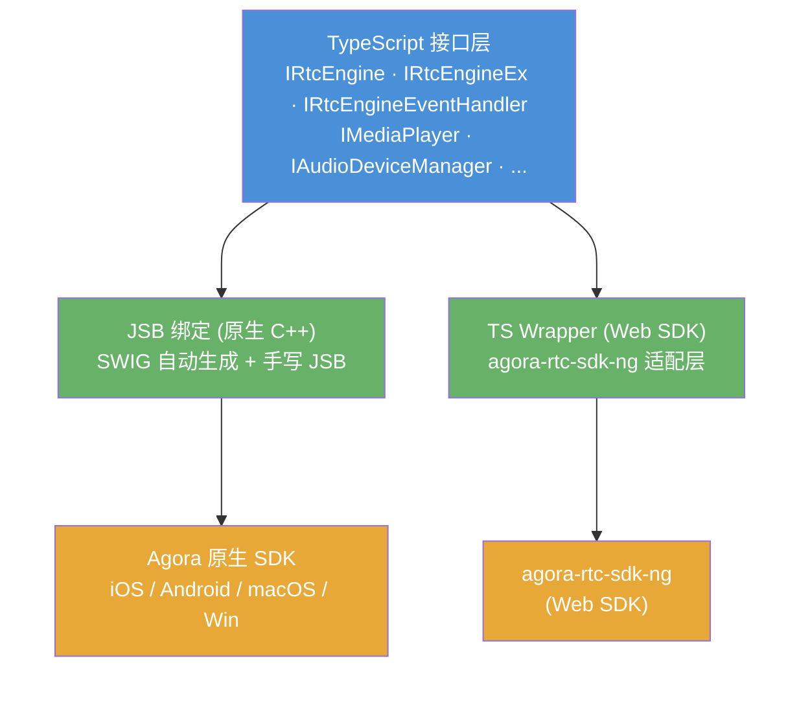
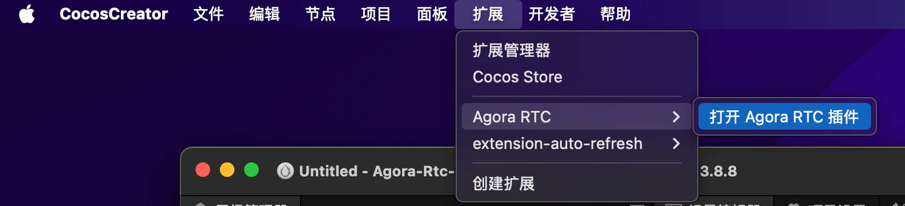
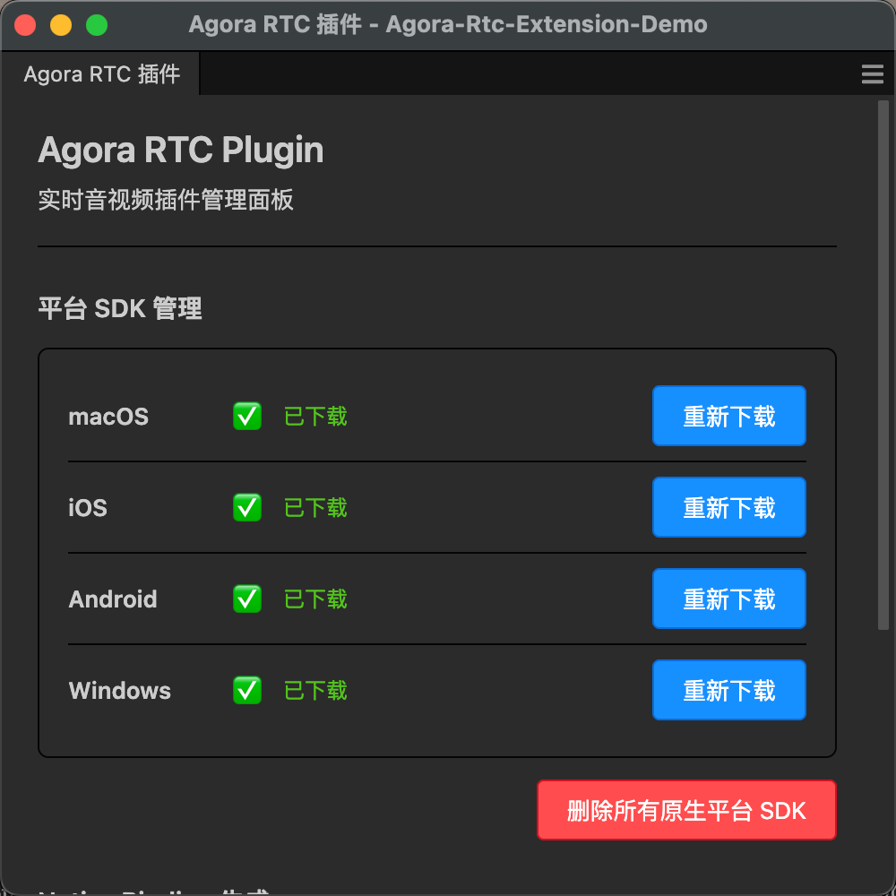
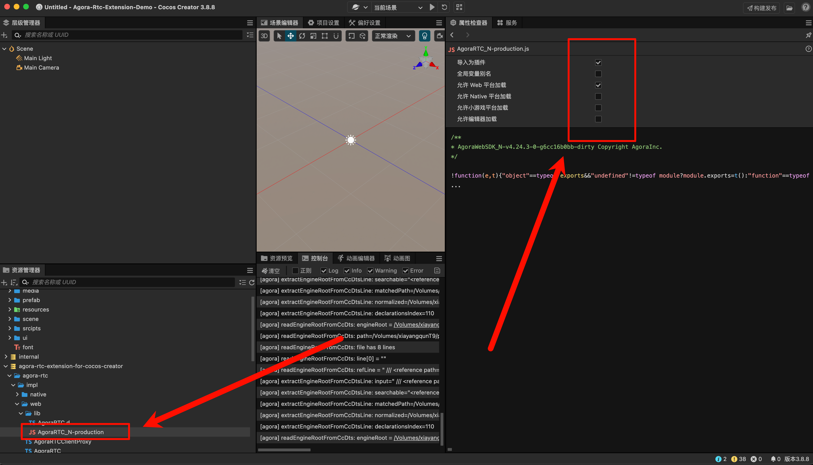

# Agora RTC Extension for Cocos Creator

[English](README.md)

一个将 [Agora RTC SDK](https://www.agora.io/) 集成到 Cocos Creator 的编辑器扩展。在你的 Cocos Creator 游戏和应用中构建视频通话、互动直播、屏幕共享和媒体播放等功能。

## 功能特性

- **视频/语音通话** — 支持 1v1 和多人实时音视频通话
- **屏幕共享** — 通话中共享屏幕内容（原生平台）
- **媒体播放器** — 播放本地和远程媒体文件，支持完整播放控制
- **媒体录制** — 将音视频流录制到本地文件
- **互动直播** — 支持 CDN 推流和转码
- **空间音频** — 3D 位置音频，打造沉浸式体验
- **美颜与视频特效** — 美颜、滤镜、虚拟背景、视频降噪
- **音乐内容中心** — 音乐播放和混音功能
- **数据通道** — 用户间发送自定义数据消息
- **内容审核** — AI 驱动的内容审核
- **加密通信** — 端到端加密保障通信安全

## 平台能力矩阵

| 能力 | iOS | Android | macOS | Windows | 浏览器 (Chrome) |
|---|:---:|:---:|:---:|:---:|:---:|
| 加入/离开频道 | ✅ | ✅ | ✅ | ✅ | ✅ |
| 视频通话 | ✅ | ✅ | ✅ | ✅ | ✅ |
| 语音通话 | ✅ | ✅ | ✅ | ✅ | ✅ |
| 静音本地音视频 | ✅ | ✅ | ✅ | ✅ | ✅ |
| 静音远端音视频 | ✅ | ✅ | ✅ | ✅ | ✅ |
| 用户角色（主播/观众） | ✅ | ✅ | ✅ | ✅ | ✅ |
| 频道模式 | ✅ | ✅ | ✅ | ✅ | ✅ |
| 屏幕共享 | ✅ | ✅ | ✅ | ✅ | ✅ |
| 屏幕采集源列表 | ❌ | ❌ | ✅ | ✅ | ❌ |
| 媒体播放器 | ✅ | ✅ | ✅ | ✅ | ⚠️ |
| 媒体录制器 | ✅ | ✅ | ✅ | ✅ | ❌ |
| 混音 | ✅ | ✅ | ✅ | ✅ | ✅ |
| 美颜效果 | ✅ | ✅ | ✅ | ✅ | ❌ |
| 滤镜效果 | ✅ | ✅ | ✅ | ✅ | ❌ |
| 虚拟背景 | ✅ | ✅ | ✅ | ✅ | ❌ |
| 视频降噪 | ✅ | ✅ | ✅ | ✅ | ❌ |
| 色彩增强 | ✅ | ✅ | ✅ | ✅ | ❌ |
| 低光增强 | ✅ | ✅ | ✅ | ✅ | ❌ |
| 空间音频 | ✅ | ✅ | ✅ | ✅ | ❌ |
| 数据流 | ✅ | ✅ | ✅ | ✅ | ✅ |
| CDN 推流 | ✅ | ✅ | ✅ | ✅ | ❌ |
| 截图 | ✅ | ✅ | ✅ | ✅ | ❌ |
| 内容审核 | ✅ | ✅ | ✅ | ✅ | ❌ |
| 加密 | ✅ | ✅ | ✅ | ✅ | ✅ |
| 音量提示 | ✅ | ✅ | ✅ | ✅ | ✅ |
| 设备管理 | ✅ | ✅ | ✅ | ✅ | ⚠️ |
| 扩展插件系统 | ✅ | ✅ | ✅ | ✅ | ❌ |

> ✅ 支持 &nbsp; ❌ 不支持 &nbsp; ⚠️ 功能受限

## 架构设计

本扩展采用分层架构，平台无关接口与平台特定实现之间有清晰的分离。



### 各层说明

**TypeScript 接口层** — 平台无关的接口定义（`IRtcEngine`、`IMediaPlayer`、`IAudioDeviceManager` 等），定义完整的 API 契约。原生和 Web 实现都遵循这些接口。

**JSB 绑定（原生 C++）** — `RtcEngineNative.ts` 使用 ES6 `Proxy` 动态将方法调用转发到 C++ 桥接层（通过 JSB）。桥接类（`*Bridge.h/.cpp`）封装 Agora 原生 SDK。SWIG 从 `.i` 接口文件自动生成大部分绑定。复杂场景（回调注册、同参数重载、桥接对象生命周期）在 `jsb_agora_rtc_manual.cpp` 中手写。

**TS Wrapper（Web SDK）** — 完整的 Web SDK 适配层（`RtcEngineWeb.ts`、`AgoraRTCClientProxy.ts`、`TrackManager.ts`），将 `agora-rtc-sdk-ng` 的能力封装为上层接口。`VideoTextureManager.ts` 将 Agora 视频轨道桥接到 Cocos Creator 的渲染管线。`Helper.ts` 提供原生和 Web SDK 枚举值之间的双向映射。

**Agora 原生 SDK** — 平台相关的 SDK 库（iOS/macOS 用 `.xcframework`，Android 用 `.aar`，Windows 用 `.dll`/`.lib`），通过 `scripts/predownload.js` 下载。

**agora-rtc-sdk-ng** — Agora 官方 Web SDK，用于浏览器端实时通信。

## 项目结构

```
├── assets/agora-rtc/
│   ├── interface/          # TypeScript 接口 (IRtcEngine, IMediaPlayer, ...)
│   └── impl/
│       ├── native/         # 原生 JSB 实现 (Proxy 模式)
│       └── web/            # Web SDK 实现 (完整适配层)
├── native/agora/           # C++ 桥接类，封装 Agora SDK
├── native/bindings/
│   ├── auto/               # SWIG 自动生成的绑定（勿手动修改）
│   └── manual/             # 手写的 JSB 绑定
├── swig-config/            # SWIG 接口文件 (.i)
├── scripts/                # 构建工具 (SWIG 生成、SDK 下载、转换器)
├── mac/                    # macOS SDK 库 + CMake 配置
├── src/                    # 编辑器扩展源码
│   ├── main.ts             # 扩展入口
│   ├── builder.ts          # 构建流程集成
│   ├── build-hooks.ts      # macOS 权限注入
│   └── panels/             # Vue 3 编辑器面板
├── i18n/                   # 国际化 (英文/中文)
└── jsb-rules/              # JSB 开发规则和模式
```

## 快速开始

1. 下载或 clone 本项目到 Cocos 项目的 `extensions` 目录下

2. 进入插件根目录，运行：

```bash
npm install
npm run build
```

3. 在 Cocos 编辑器中打开 **扩展 → Agora RTC → 打开 AgoraRTC 插件**

   

4. 选择想要支持的平台 SDK，点击下载

   

5. `agora-rtc-sdk-ng` 默认包含在 SDK 中，无需额外下载。将其设置为插件，如图所示：

   

6. 在 Cocos 项目的 `tsconfig.json` 中添加插件脚本的搜索路径，使代码提示正常工作：

```json
{
  "extends": "./temp/tsconfig.cocos.json",
  "compilerOptions": {
    "strict": false,
    "baseUrl": ".",
    "paths": {
      "db://agora-rtc-extension-for-cocos-creator/*": [
        "./extensions/agora-rtc-extension-for-cocos-creator/assets/*"
      ]
    }
  }
}
```

7. 使用如下代码快速上手：

**音视频通话**

```typescript
import {
    IRtcEngineEx,
    IRtcEngineEventHandler,
    createRtcEngine,
    RtcEngineContext,
    RtcConnection,
    ChannelMediaOptions,
    VideoCanvas,
    VIDEO_SOURCE_TYPE,
    CLIENT_ROLE_TYPE,
    CHANNEL_PROFILE_TYPE,
} from "db://agora-rtc-extension-for-cocos-creator/agora-rtc";
import { Texture2D, SpriteFrame, Sprite } from "cc";

// 1. 创建并初始化引擎
let rtcEngine: IRtcEngineEx = createRtcEngine();
let config: RtcEngineContext = {
    appId: "<YOUR_APP_ID>",
    channelProfile: CHANNEL_PROFILE_TYPE.CHANNEL_PROFILE_COMMUNICATION,
};
await rtcEngine.initialize(config);

// 2. 创建本地和远端视图的纹理
let localTexture: Texture2D = new Texture2D();
let localSpriteFrame: SpriteFrame = new SpriteFrame();
localSpriteFrame.texture = localTexture;
localSpriteFrame.packable = false;
localSprite.spriteFrame = localSpriteFrame; // 绑定到 Sprite 组件

let remoteTexture: Texture2D = new Texture2D();
let remoteSpriteFrame: SpriteFrame = new SpriteFrame();
remoteSpriteFrame.texture = remoteTexture;
remoteSpriteFrame.packable = false;
remoteSprite.spriteFrame = remoteSpriteFrame;

// 3. 开启视频并加入频道
await rtcEngine.enableVideo();
let options: ChannelMediaOptions = {
    clientRoleType: CLIENT_ROLE_TYPE.CLIENT_ROLE_BROADCASTER,
    publishCameraTrack: true,
    publishMicrophoneTrack: true,
    autoSubscribeAudio: true,
    autoSubscribeVideo: true,
};
await rtcEngine.joinChannel("<TOKEN>", "<CHANNEL_ID>", 0, options);

// 4. 绑定本地视图 — 可在任意时刻调用
let localCanvas: VideoCanvas = {
    uid: 0,
    view: localTexture,
    sourceType: VIDEO_SOURCE_TYPE.VIDEO_SOURCE_CAMERA,
    mediaPlayerId: 0,
};
rtcEngine.setupLocalVideo(localCanvas);

// 5. 远端用户加入时绑定远端视图（在 onUserJoined 回调中）
onUserJoined(connection: RtcConnection, remoteUid: number, elapsed: number) {
    let remoteCanvas: VideoCanvas = {
        uid: remoteUid,
        view: remoteTexture,
        sourceType: VIDEO_SOURCE_TYPE.VIDEO_SOURCE_REMOTE,
        mediaPlayerId: 0,
    };
    rtcEngine.setupRemoteVideo(remoteCanvas);
}

// 6. 清理 — 解绑视图、销毁纹理，然后释放引擎
rtcEngine.setupLocalVideo({ uid: 0, view: null, sourceType: VIDEO_SOURCE_TYPE.VIDEO_SOURCE_CAMERA, mediaPlayerId: 0 });
rtcEngine.setupRemoteVideo({ uid: remoteUid, view: null, sourceType: VIDEO_SOURCE_TYPE.VIDEO_SOURCE_REMOTE, mediaPlayerId: 0 });
localTexture.destroy();
localSpriteFrame.destroy();
remoteTexture.destroy();
remoteSpriteFrame.destroy();
await rtcEngine.leaveChannel();
await rtcEngine.release(true);
rtcEngine = null;
```

**媒体播放器**

```typescript
import {
    IRtcEngineEx,
    IMediaPlayer,
    createRtcEngine,
    RtcEngineContext,
    ChannelMediaOptions,
    VideoCanvas,
    VIDEO_SOURCE_TYPE,
    CLIENT_ROLE_TYPE,
    CHANNEL_PROFILE_TYPE,
} from "db://agora-rtc-extension-for-cocos-creator/agora-rtc";
import { Texture2D, SpriteFrame, Sprite } from "cc";

// 1. 创建并初始化引擎，加入频道
let rtcEngine: IRtcEngineEx = createRtcEngine();
let config: RtcEngineContext = {
    appId: "<YOUR_APP_ID>",
    channelProfile: CHANNEL_PROFILE_TYPE.CHANNEL_PROFILE_COMMUNICATION,
};
await rtcEngine.initialize(config);
await rtcEngine.enableVideo();
let options: ChannelMediaOptions = {
    clientRoleType: CLIENT_ROLE_TYPE.CLIENT_ROLE_BROADCASTER,
    autoSubscribeAudio: true,
    autoSubscribeVideo: true,
};
await rtcEngine.joinChannel("<TOKEN>", "<CHANNEL_ID>", 0, options);

// 2. 创建媒体播放器
let mediaPlayer: IMediaPlayer = await rtcEngine.createMediaPlayer();
let playerId: number = await mediaPlayer.getId();

// 3. 创建媒体播放器视图的纹理
let mpkTexture: Texture2D = new Texture2D();
let mpkSpriteFrame: SpriteFrame = new SpriteFrame();
mpkSpriteFrame.texture = mpkTexture;
mpkSpriteFrame.packable = false;
mediaPlayerSprite.spriteFrame = mpkSpriteFrame; // 绑定到 Sprite 组件

// 4. 绑定媒体播放器视图
let canvas: VideoCanvas = {
    uid: 0,
    view: mpkTexture,
    sourceType: VIDEO_SOURCE_TYPE.VIDEO_SOURCE_MEDIA_PLAYER,
    mediaPlayerId: playerId,
};
rtcEngine.setupLocalVideo(canvas);

// 5. 打开并播放 — 等待 onPlayerSourceStateChanged 返回 PLAYER_STATE_OPEN_COMPLETED 后再 play()
await mediaPlayer.open("https://example.com/video.mp4", 0);
await mediaPlayer.play();

// 6. 销毁媒体播放器 — 先解绑视图并销毁纹理
rtcEngine.setupLocalVideo({
    uid: 0,
    view: null,
    sourceType: VIDEO_SOURCE_TYPE.VIDEO_SOURCE_MEDIA_PLAYER,
    mediaPlayerId: playerId,
});
mpkTexture.destroy();
mpkSpriteFrame.destroy();
await rtcEngine.destroyMediaPlayer(mediaPlayer);

// 7. 释放引擎 — release 后不能再访问 mediaPlayer 的任何方法
await rtcEngine.leaveChannel();
await rtcEngine.release(true);
rtcEngine = null;
```

> ⚠️ **重要**：创建 `SpriteFrame` 时必须设置 `packable = false`，防止 Cocos 将视频纹理打入动态图集。调用 `release` 前，必须先解绑所有视频视图（`view: null`）并 `destroy()` 所有 `Texture2D` 和 `SpriteFrame` 实例。`release` 之后，`mediaPlayer` 实例已失效，不要再调用其任何方法。

8. 我们准备了一个丰富的示例项目供你参考：[Agora-Rtc-Extension-Demo](https://github.com/xiayangqun/Agora-Rtc-Extension-Demo)

## 环境要求

- Cocos Creator >= 3.8.8
- Node.js >= 16
- Xcode（macOS/iOS 构建）
- Android Studio（Android 构建）
- Visual Studio（Windows 构建）
